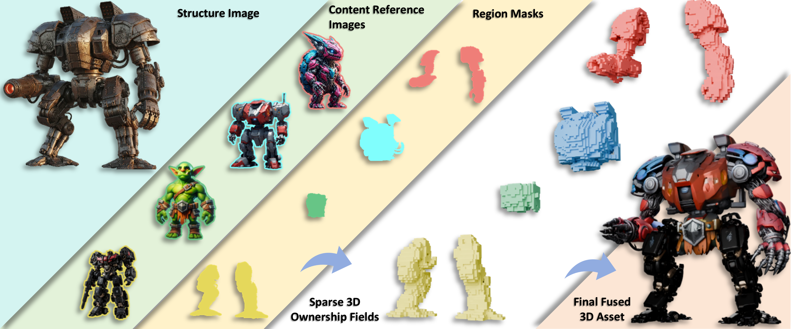

# OwnerFusion3D Anonymous Release

This repository contains the OwnerFusion3D extension for training-free,
mask-guided local image-to-3D fusion. It is intended for anonymous review and
provides the implementation, configuration defaults, input schemas, and
reproduction notes needed to run the method.

OwnerFusion3D is instantiated on the frozen TRELLIS.2 image-to-3D generator.
The TRELLIS.2 runtime, its custom CUDA extensions, and the model checkpoint are
external dependencies and are not redistributed in this repository.

## Repository layout

    ownerfusion3d/       OwnerFusion3D Python package
    examples/            Schemas and runnable single/multi-mask demos
    tests/               Lightweight unit and interface tests
    scripts/             Local release verification helpers

The package provides:

- single-mask fusion through MOE and OEHR;
- multi-mask, multi-reference fusion through MOE, COR, and OEHR;
- fixed paper defaults and controlled ablation settings;
- single-case and batch command-line entry points.

## TRELLIS.2 dependency

Install the official TRELLIS.2 project and its dependencies first, following
the installation instructions provided by that project. The runtime must make
the trellis2 and o_voxel Python packages available in the active environment.

From the TRELLIS.2 checkout, install its package and custom extensions as
described by the upstream project. Then, from this release directory, install
the extension without replacing the upstream runtime:

    python -m pip install -e /path/to/ownerfusion3d-anonymous-release --no-deps

When this directory is copied into the TRELLIS.2 checkout, the same command can
be run with the local release path. No model weights are included here. A local
compatible background removal checkpoint can be selected through the runtime
option documented in ownerfusion3d/README.md.

## Minimal commands

The repository includes two compact input demonstrations. They are intended
to be run from the repository root after the external TRELLIS.2 runtime is
installed:

- `examples/demo_single/` contains a single-mask example.
- `examples/demo_multipart/` contains a multi-part, multi-reference example.

Each directory contains a README with the exact command and input mapping.

Run a single-mask case:

    python -m ownerfusion3d \
      --structure /path/to/structure.png \
      --mask /path/to/mask.png \
      --content /path/to/content.png \
      --output-dir /path/to/output \
      --model microsoft/TRELLIS.2-4B \
      --seed 2026

Run a multi-part case:

    python -m ownerfusion3d.cli.fuse_parts \
      --structure /path/to/structure.png \
      --parts /path/to/parts_manifest.json \
      --output-dir /path/to/output \
      --model microsoft/TRELLIS.2-4B \
      --seed 2026

The command names may also be installed as ownerfusion3d and
ownerfusion3d-parts by the package metadata. Masks must be aligned to the
structure image and defined in its camera view. They are jointly resized and
cropped with the structure image before ownership estimation.

## Configuration

The default paper configuration uses the frozen TRELLIS.2-4B generator, seed
2026, four LR ownership-probe steps, the fixed stable_midlate_4 readout,
threshold 0.58. 

Each run writes a final mesh.glb, a metadata.json, and optional sparse
ownership diagnostics. 

## Verification

Run the lightweight checks before a full GPU generation:

    python -m compileall -q ownerfusion3d
    python -m ownerfusion3d --help
    python -m ownerfusion3d.cli.fuse_parts --help
    python -m ownerfusion3d.cli.batch --help
    python -m ownerfusion3d.cli.batch_parts --help
